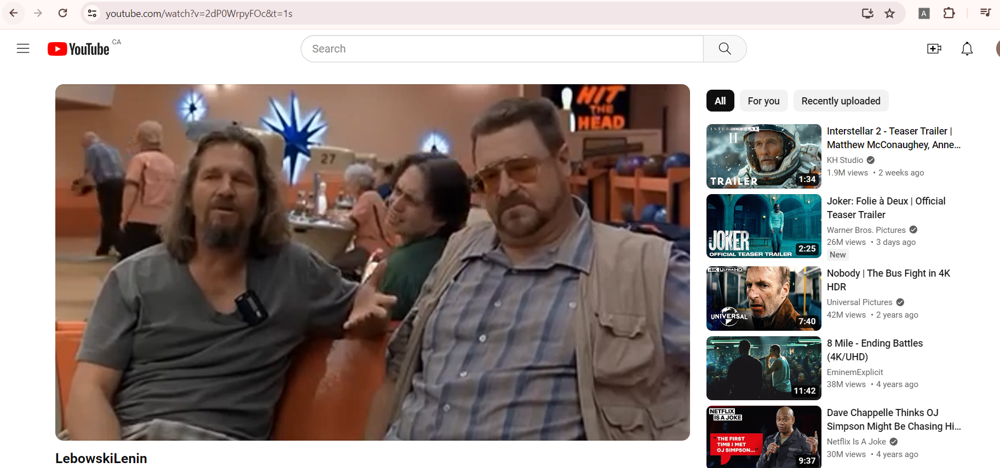
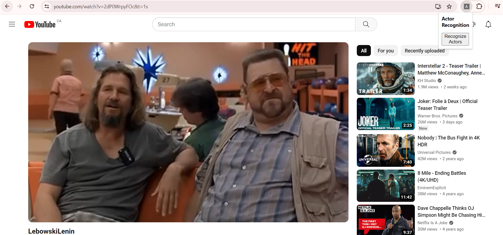
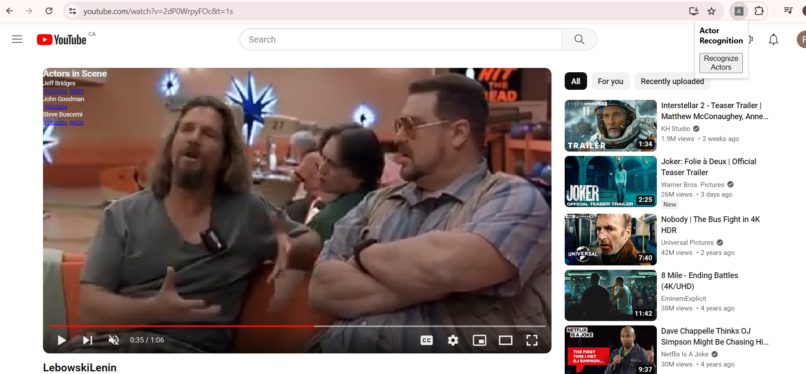

# Actor Recognition

## Summary
This program is to recognize actors in videos and display a short summary of them (i.e. name and IMDb URL) via a browser extension.

## Functional Overview

This extension allows users to click a button when watching a Youtube video that would pause the video and display for each actor in the scene their name and relevant URLs (IMDb and/or Wikidata) overlayed on to of the Youtube video. Once the user resumes the video, the information regarding the actors disappears.

### Demo Screenshots

Here are steps for how a user may interact with the extension. 

1. The user is watching a video on Youtube.

2. The user opens the extension by clicking on it, revealing the Recognize button (extension located at top-right corner).

3. The user clicks the Recognize button which displays the actors' names and relevant URLs in the top-left corner of the video.

## Technical Overview

The extension source code is written in two languages - Python for the backend and JavaScript (with some HTML) for the frontend. The extension also uses a number of AWS resources for its functionality, which are described below.

There are two main parts to the extension - a pre-processing of videos when they are uploaded, and a client-side Google Chrome extension to retrieve and display the data to the user in the way described above.

Below is a description of each part.

### Pre-processing of Videos when Uploaded
For a video to be compatible for use with the extension, it needs to be uploaded to two places and processed. Here are the steps for uploading a video, as well as the flow of data when it is processed.

1. Upload a video file (e.g. mp4) to a designated Youtube channel. Once uploaded, make note of the video ID in the URL (found after v=) for later.

2. Upload the same video file to a specified S3 bucket. Set the video ID from step 1 as a tag for the video (set it as value, with key being "videoId"). This will be used for storing in the database.

3. The video being uploaded into the specified S3 bucket creates an event that triggers a Lambda function. Its source code is found in `LambdaFunctions/VideoUpload/video_uploaded.py`. The function extracts necessary data about the video as well as setting information for a designated SNS topic. It then sends that information to Rekognition calling its `start_celebrity_recognition` functionality.

4. Rekognition processes the video from the S3 bucket and works on recognizing celebrities in it. When finished, it writes the results to the SNS topic specified earlier.

5. The message recieved by the SNS topic triggers a Lambda function with source code found in `LambdaFunctions/ProcessVideo/process_video.py`. The function retrieves Rekognition's result by calling its `get_celebrity_recognition` functionality. It then processes the result from Rekognition and works on grouping the actors by timestamps to display to the user. When finished, the video and actor information, in a JSON format, are written to a DynamoDB table, using the video ID as the primary key. It is extracted from the S3 object's tag (see step 2).

### Google Chrome Extension
Here is a description of the flow of data and what happens when a user interacts with the extension.

1. The user is watching a video on Youtube that is part of the dsignated channel for the extension's use. This ensures the same video exists in S3 with its processed information in the database (see Functional Overview).

2. The user clicks on the extension's Recognize button.

3. The extension extracts the video ID from the video's URL. It will be used for getting data about the video.

4. The extension checks Chrome's local storage for the video's information. It will be there if the user has clicked the button before for this video and the data hasn't expired from local storage yet. If the data is in local storage return it and skip to step 7. Otherwise continue straight below.

5. If the data is not in Chrome local storage, then execute an API call using a specified endpoint. This will be a POST request with the payload passed being the video ID.

6. The API endpoint is an AWS API Gateway that triggers a Lambda function with source code found in `LambdaFunctions/GetVideo/get_video.py`. The function searches the DynamoDB table for a video with the matching ID as its primary key. Then return the retrieved JSON object back to the frontend.

7. Using the retrieved JSON object (either from local storage or from API call), determine which group of actors to display based on the timestamp. Once determined, pause the video and render the information overlayed on top of the video (as shown in functional overview above).

8. If video information was retrieved via API call, cache the data in Chrome local storage for any future usages by this user.

## Limitations and Future Improvements

The extension faces a number of limitations in its functionality that could be improved in future. Here is a short description of them with possible future fixes.

- Since Rekognition requires the video to be uploaded to an S3 bucket, then it means we must possess the file of the video to send for processing. This limits the current extension from working directly with any video streaming service (e.g. Netflix). In future however, if a streaming service wanted to use the extension the only part that would have to change is the front-end side of the application, provided the videos are being stored on AWS S3.

- Currently, we upload the video to two different locations in order to use the extension. This is inconvenient to do. It can be solved in the same way as the previous point, or perhaps by using an existing public Youtube video, provided you are able to get the video file and upload it to S3.

- Rekognition's level of accuracy when recognizing celebrtities may not be the most reliable and can sometimes recognize the wrong actors or miss a key actor in the scene. This is out of my control while using Rekognition.

- When Rekognition returns a response, it provides a level of confidence in its recognition (number from 0-1). Currently, when the video is processed the function ignores this information. In future, there could be an implementation for either setting a default minimum level of confidence, or allowing the user to choose a desired minimum level of confidence in recognition (e.g. process actors only if at least 50% confident).
